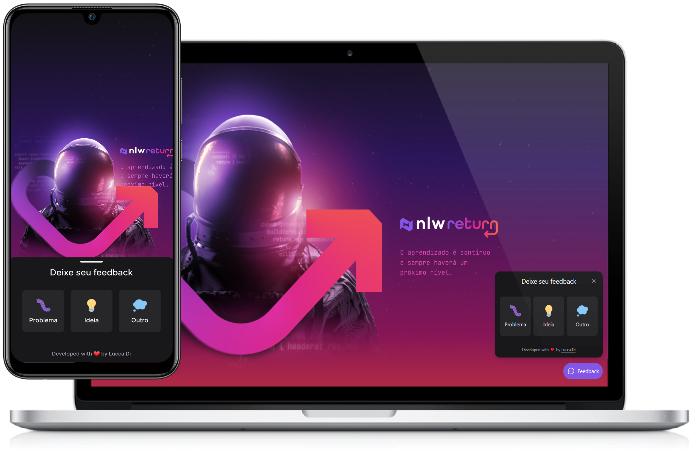

<h1 align="center">🚀 Feedget 🚀</h1>

<p align="center">
  
  
  
</p>

<p align="center">
  <a href="#-project">Project</a> |
  <a href="#-technologies">Technologies</a> |
  <a href="#-features">Features</a> |
  <a href="#-getting-started">Getting started</a> |
  <a href="#-license">License</a>
</p>

<p style="display: flex" align="center">
    
</p>

## 💻 Project

API of a feedback widget application, dubbed "Feedget", which can be added to any mobile or web environment.

The user chooses a type of feedback to be sent, after that a description is requested for the feedback and optionally the user can automatically add a screenshot, after sending the feedback will be registered in the database and an email will be automatically sent to the website/application owner.

Project developed during Rocketseat's Next Level Week Return

Access the running application: https://feedget-app.vercel.app

Web version: [Feedback Widget (Web)](https://github.com/LuccaDi/feedback-widget-web)

Mobile version: [Feedback Widget (Mobile)](https://github.com/LuccaDi/feedback-widget-mobile)


## 🚀 Technologies

- [Node.js](https://nodejs.org/en/)
- [Typescript](https://www.typescriptlang.org/)
- [Express](https://expressjs.com)
- [Prisma](https://www.prisma.io)
- [Jest](https://jestjs.io)
- [Nodemailer](https://nodemailer.com/about/)

## 🛠 Features 

✔️ Send text feedback
  
✔️ Button to send automatic screenshot, requiring no other user action

✔️ Automatic emailing to website/app owner

✔️ Possibility of sending a new feedback at the end

<!---
🛠️ Dark and light theme
🚧 Dashboard to track the feedbacks received
-->

## 🏁 Getting started

### Requirements

- [Node.js](https://nodejs.org/en/)
- [Yarn](https://classic.yarnpkg.com/) or [npm](https://www.npmjs.com/package/npm)


**Clone the project and access the folder**

```bash
git clone https://github.com/LuccaDi/feedback-widget-api.git && cd feedback-widget-api
```


**Follow the steps below**

### Server


```bash
# Install the dependencies
$ npm install

# Make a copy of '.env.example' to '.env'
# and set with YOUR environment variables.
$ cp .env.example .env

# With a PostgreSQL running, run the migrations
$ npx prisma migrate dev

# Start the server
$ npm run dev
```

**To test the full application**

After running the server you must run the web version ([Feedback Widget (Web)](https://github.com/LuccaDi/feedback-widget-web)) or/and the mobile version ([Feedback Widget (Mobile)](https://github.com/LuccaDi/feedback-widget-mobile))


## 📝 License

This project is licensed under the MIT License - see the [LICENSE](LICENSE) file for details.

---

<p align="center">
  Made with ❤️ by <a href="https://www.linkedin.com/in/luccadi/">Lucca Di Bastiani</a>
</p>
